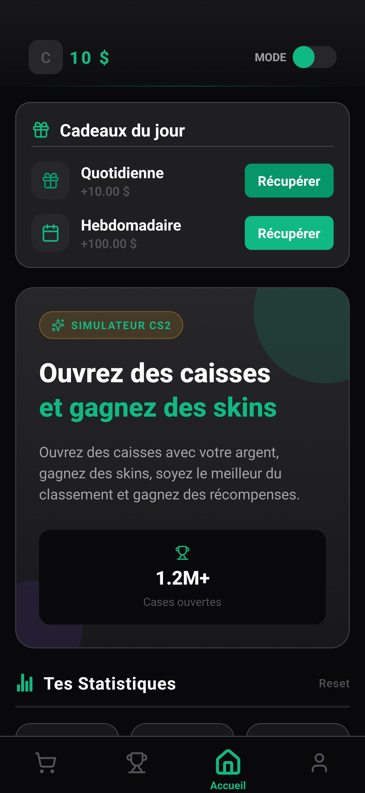
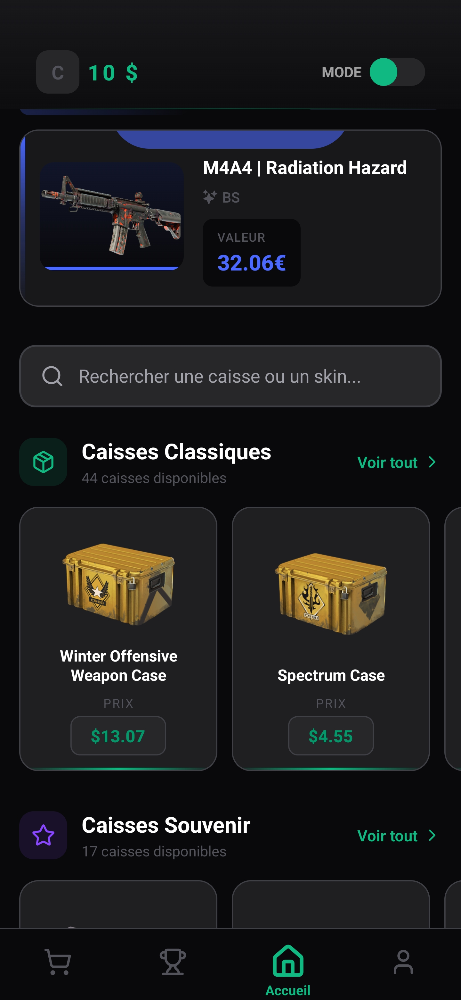
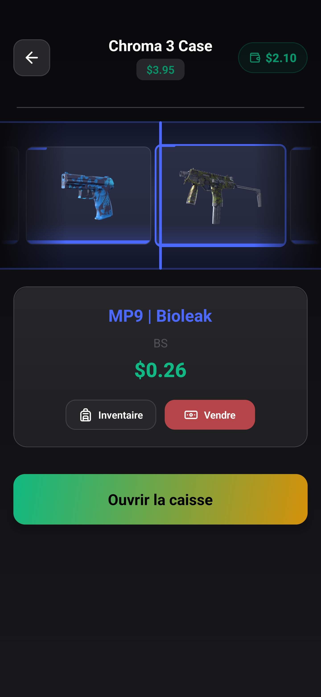
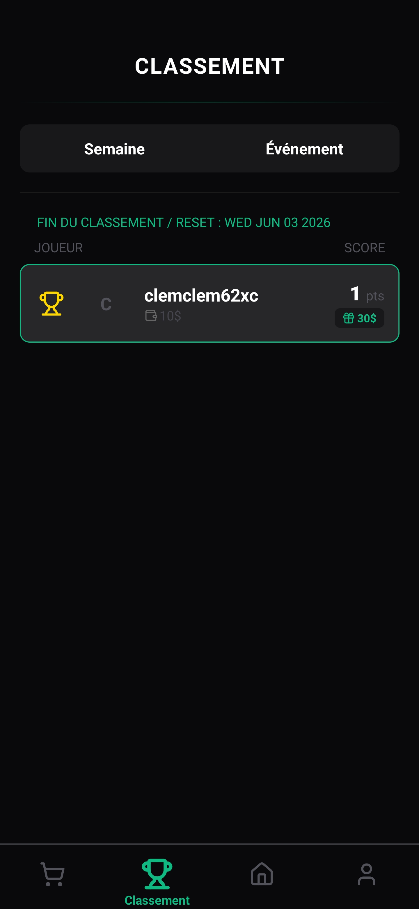
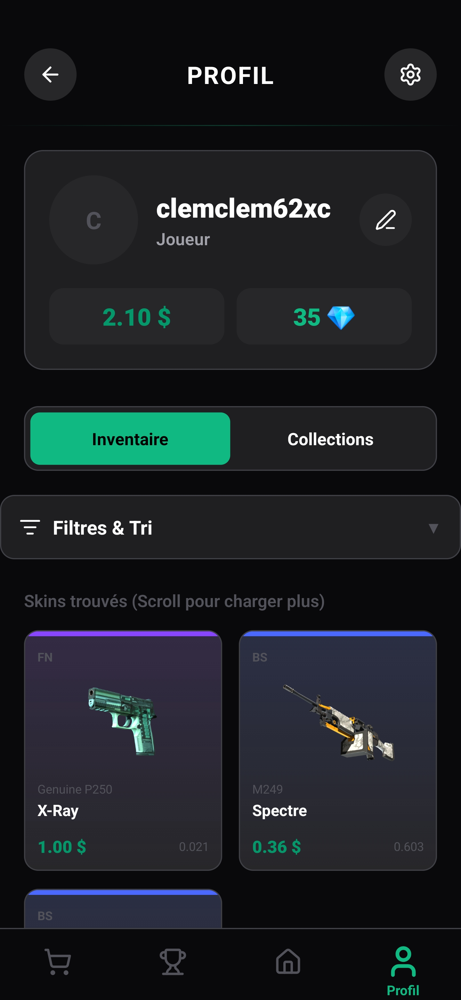

# 📦 CaseSim - Simulateur de Caisses CS2 Compétitif


CaseSim n'est pas qu'un simple simulateur d'ouverture de caisses Counter-Strike 2. C'est une **expérience compétitive multijoueur** avec une véritable économie intégrée. Affrontez d'autres joueurs dans des classements hebdomadaires, gérez votre budget, revendez vos skins stratégiquement et débloquez du contenu exclusif dans la boutique.

## 📸 Captures d'écran

<div align="center">
  
  
  
  
  
</div>

## 🎮 Boucle de Jeu (Game Loop)

1. **Matchmaking (Caisse de Départ) :** Le joueur ouvre une caisse gratuite qui déclenche un algorithme de matchmaking (`find_or_create_leaderboard`). Il est placé dans un groupe de 30 joueurs maximum avec un budget de départ (ex: 10.00$).
2. **Ouverture & RNG :** Le joueur dépense son solde pour ouvrir des caisses. La valeur du skin obtenu (basée sur les vrais prix du marché) s'ajoute à son score de tournoi.
3. **Le Pari (Revente) :** Le joueur peut revendre ses skins depuis son inventaire. Cela lui redonne de l'argent pour ouvrir d'autres caisses, **mais déduit la valeur du skin de son score**.
4. **Wipe Hebdomadaire :** Chaque semaine, un *Cron Job* clôture les tournois, distribue les récompenses Premium/Boutique selon le classement final, et réinitialise les inventaires.

## 🛠️ Stack Technique

### Frontend (Application Mobile)
* **Framework :** React Native (Nouvelle Architecture) avec [Expo Router](https://docs.expo.dev/router/introduction/) (file-based routing).
* **Interface (UI) :** [Tamagui](https://tamagui.dev/) pour des composants universels, stylisés et performants.
* **State Management (Serveur) :** [React Query](https://tanstack.com/query/v3/) (Utilisation massive d'`Optimistic Updates` pour une latence perçue de 0ms sur l'économie).
* **State Management (Local) :** Zustand (pour la persistance locale des statistiques via AsyncStorage).
* **Animations :** React Native Reanimated (Animations 60 FPS sur le thread UI pour la roulette).

### Backend (BaaS)
* **Database :** [Supabase](https://supabase.com/) (PostgreSQL) avec Row Level Security (RLS).
* **Mutations Sécurisées :** Utilisation exclusive de fonctions **RPC (Remote Procedure Call)** pour toutes les transactions financières (Achat, Revente, Récompenses) afin d'éviter la triche côté client.
* **Logique Serveur :** Deno Edge Functions pour la génération RNG sécurisée des drops (taux de drop officiels CS2).
* **Automatisation :** `pg_cron` pour le système de wipe hebdomadaire.

## 🏗️ Architecture & Flux de Données

Afin de garantir une expérience fluide sans compromettre la sécurité, l'application utilise une architecture hybride :

```text
Client (React Query / Optimistic UI) ──► Edge Functions (Deno) ──► Supabase RPC (PostgreSQL)
                                               │
                                               ▼
                                        Transaction Sécurisée